# 🛍️ MaBoutique - Full-Stack Mobile Commerce Platform

[](https://flutter.dev/)
[](https://fastapi.tiangolo.com/)
[](https://www.python.org/)
[](https://www.sqlite.org/)

A modern, full-stack e-commerce mobile application built with Flutter and FastAPI, featuring secure authentication, real-time cart management, and an elegant dark/light theme system.

---

## 📋 Table of Contents

- [Overview](#-overview)
- [Features](#-features)
- [Tech Stack](#-tech-stack)
- [Screenshots](#-screenshots)
- [Architecture](#-architecture)
- [Installation](#-installation)
- [Running the Application](#-running-the-application)
- [API Documentation](#-api-documentation)
- [Project Structure](#-project-structure)
- [Security Features](#-security-features)

---

## 🎯 Overview

**MaBoutique** is a comprehensive mobile commerce platform designed to demonstrate modern mobile development best practices. The application provides a seamless shopping experience with real-time cart updates, secure user authentication, and a responsive UI that adapts to user preferences.

### Why MaBoutique?

- **Production-Ready Architecture**: Implements industry-standard patterns for state management, API communication, and security
- **Full-Stack Integration**: Demonstrates seamless communication between Flutter frontend and FastAPI backend
- **Modern UI/UX**: Features a polished interface with dark/light mode support and smooth animations
- **Scalable Design**: Built with extensibility in mind, allowing easy addition of new features

---

## ✨ Features

### Core Functionality
- 🔐 **Secure Authentication System** - JWT-based authentication with password hashing
- 🛒 **Dynamic Shopping Cart** - Real-time cart management with automatic price calculations
- ❤️ **Wishlist Management** - Save favorite items for later
- 🎨 **Dark/Light Theme** - System-wide theme switching with persistent preferences
- 👤 **User Profile Management** - View and manage account information
- 📱 **Responsive Design** - Optimized for various screen sizes
- 🔄 **Real-time State Sync** - Instant UI updates across the application
- 🎯 **Product Categories** - Browse products by categories (Men, Women, Kids, Accessories)

### Technical Features
- **JWT Bearer Token Authentication** for secure API access
- **Bcrypt Password Hashing** for user credential protection
- **SQLAlchemy ORM** for robust database operations
- **Provider Pattern** for efficient state management
- **RESTful API Design** following best practices
- **Error Handling** with user-friendly messages
- **Form Validation** on both client and server side

---

## 🛠 Tech Stack

### Frontend (Mobile)
- **Flutter 3.x** - UI framework
- **Dart** - Programming language
- **Provider** - State management
- **HTTP** - API communication
- **Shared Preferences** - Local data persistence
- **JWT Decoder** - Token handling

### Backend (API)
- **Python 3.9+** - Programming language
- **FastAPI** - Web framework
- **SQLAlchemy** - ORM
- **Pydantic** - Data validation
- **Passlib + Bcrypt** - Password hashing
- **python-jose** - JWT token generation
- **SQLite** - Database
- **Uvicorn** - ASGI server

---

## 📱 Screenshots

### Splash & Welcome Screens

<p align="center">
  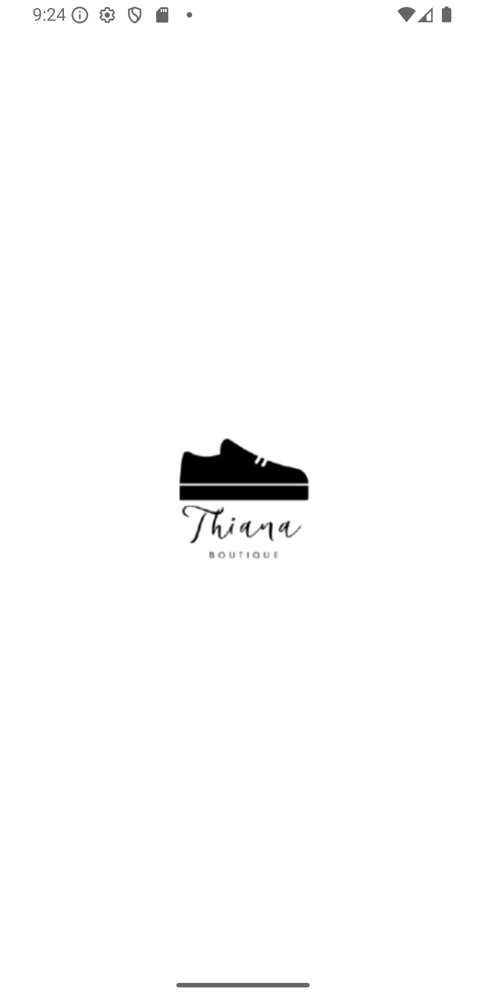
  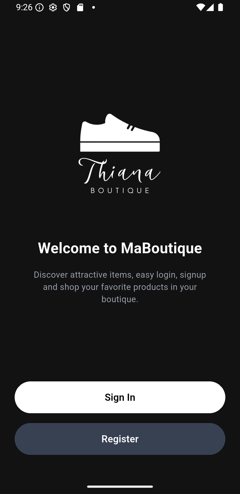
  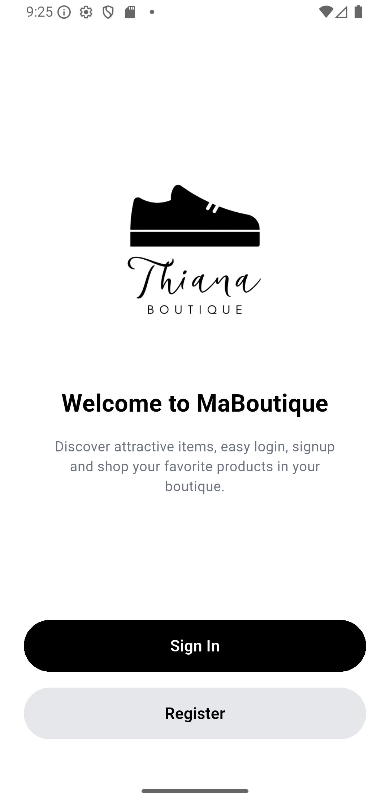
</p>

The splash screen provides a branded entry point with smooth animations, while the welcome screen introduces new users with clear value propositions and quick access to authentication.

### Authentication Flow

<p align="center">
  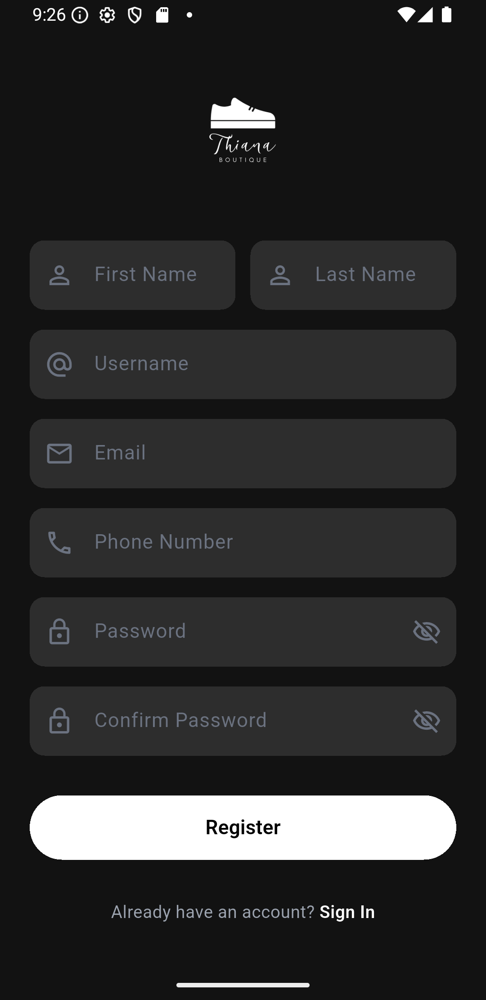
  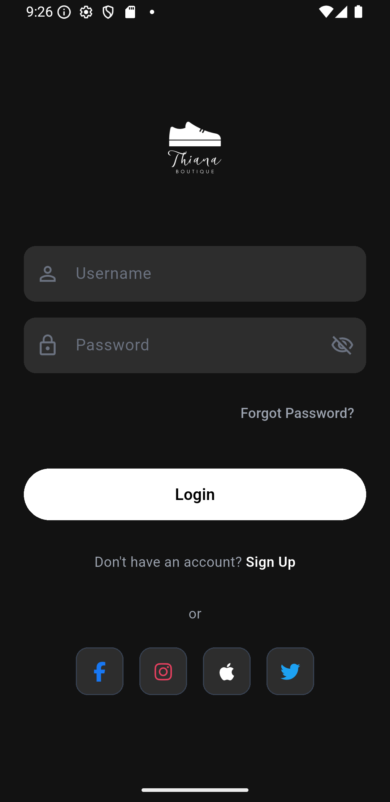
  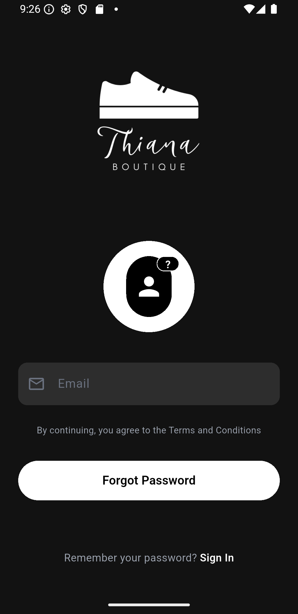
</p>

<p align="center">
  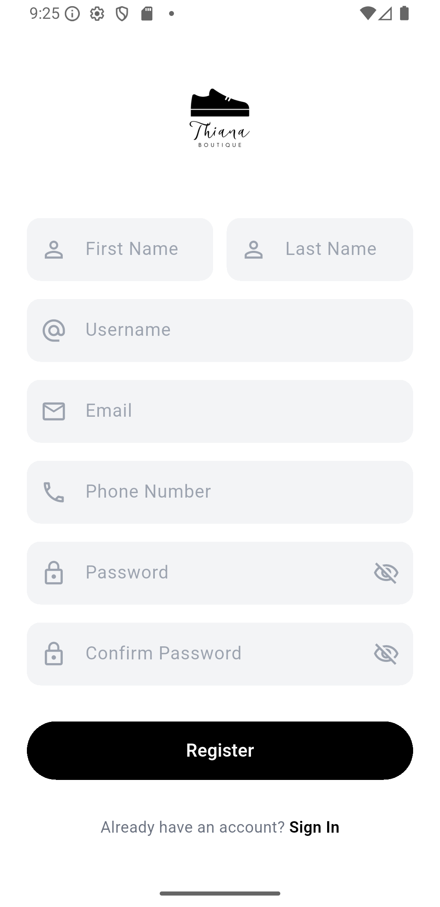
  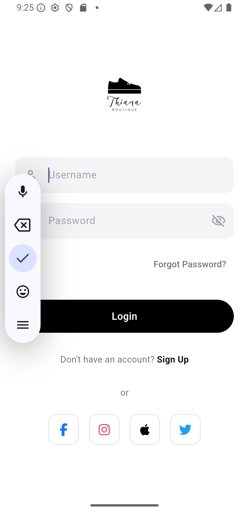
  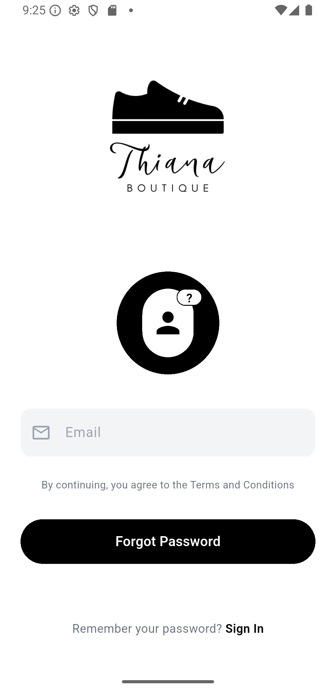
</p>

**Authentication Features:**
- Full name, email, and password collection with validation
- JWT token generation and secure storage
- Password strength requirements and matching confirmation
- Password recovery functionality
- Real-time form validation with user feedback
- Automatic login after successful registration

**Security Implementation:**
- Passwords hashed with Bcrypt (cost factor: 12)
- JWT tokens with configurable expiration
- Secure token storage on device
- Protected API routes requiring valid tokens

### Home Screen - Product Browsing

<p align="center">
  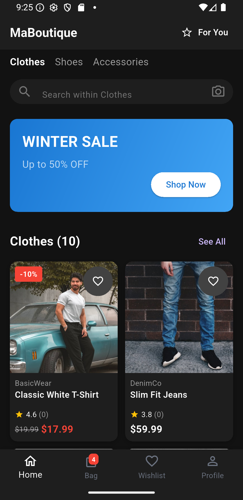
  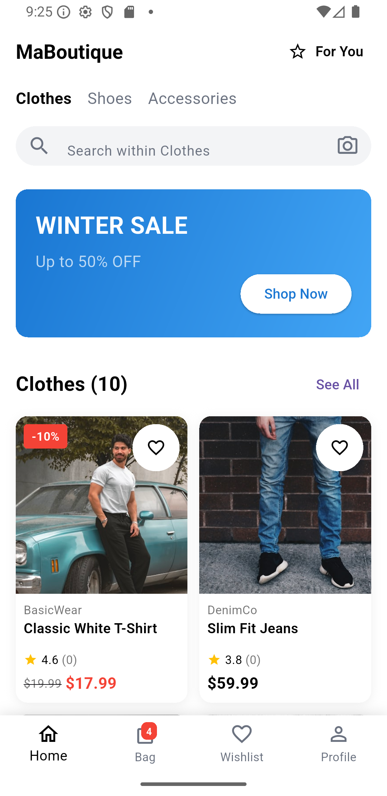
</p>

**Home Screen Features:**
- **Search Bar**: Quick product search functionality
- **Category Navigation**: Browse by Men, Women, Kids, Accessories
- **Featured Products**: Curated product showcase with:
  - High-quality product images
  - Product name and brand display
  - Dynamic pricing display
  - Quick add to cart button
  - Wishlist toggle (heart icon)
  - Rating and review indicators
- **Special Offers**: Promotional banners and deals
- **Bottom Navigation**: Quick access to Cart, Wishlist, and Profile

**Dark Mode**: AMOLED-friendly dark background with high contrast for readability and reduced eye strain

**Light Mode**: Clean, minimalist design with optimal daylight readability and professional appearance

### Shopping Cart

<p align="center">
  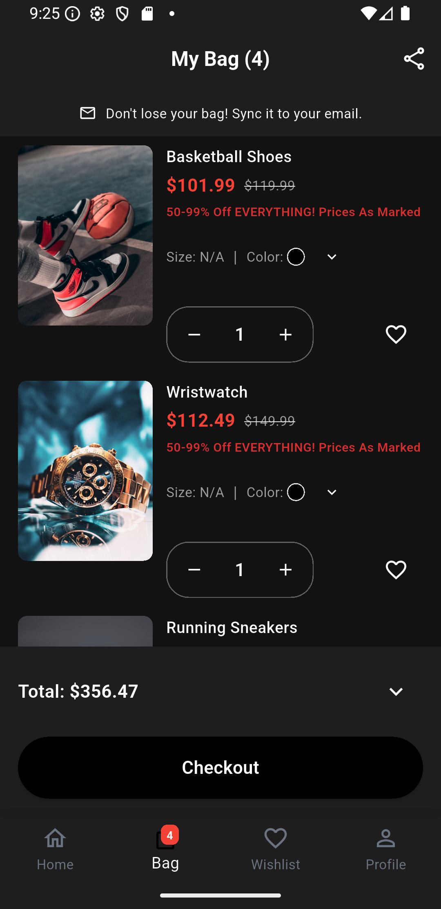
  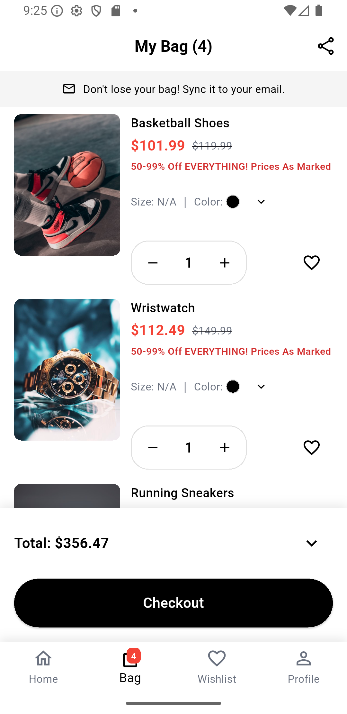
</p>

**Cart Features:**
- **Item Management**:
  - Increase/decrease quantity with + and - buttons
  - Remove items with swipe gesture or delete button
  - Save items for later option
- **Price Calculation**:
  - Individual item subtotals
  - Automatic discount application
  - Shipping cost calculation
  - Tax computation
  - Grand total display
- **Visual Feedback**:
  - Loading indicators during updates
  - Success/error messages
  - Empty cart state with call-to-action
- **Checkout Process**:
  - Proceed to checkout button
  - Address selection
  - Payment method integration ready

### Wishlist

<p align="center">
  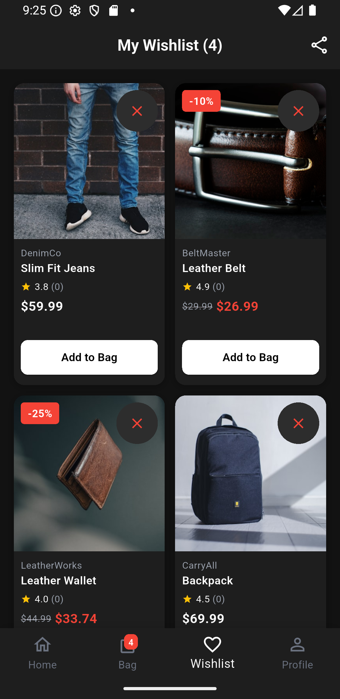
  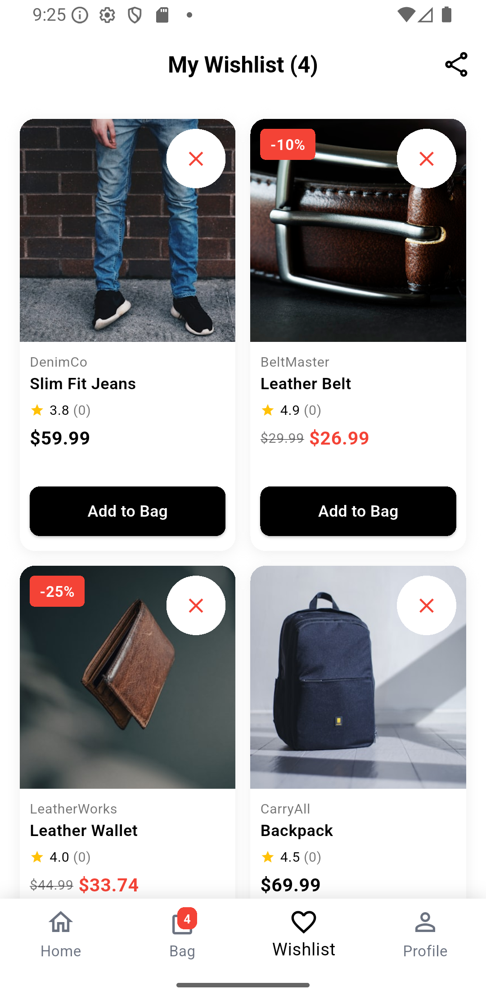
</p>

**Wishlist Features:**
- **Item Management**:
  - Add/remove items with heart icon toggle
  - Move to cart with single tap
  - Share wishlist with friends
  - View product details
- **Smart Features**:
  - Price drop notifications ready
  - Stock availability alerts
  - Similar product suggestions
  - Persistent across devices
- **Organization**:
  - Sort by date added, price, or brand
  - Filter by category
  - Multiple wishlists support ready

### User Profile

<p align="center">
  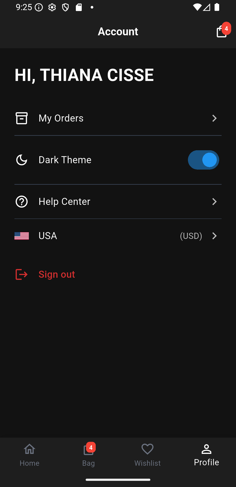
  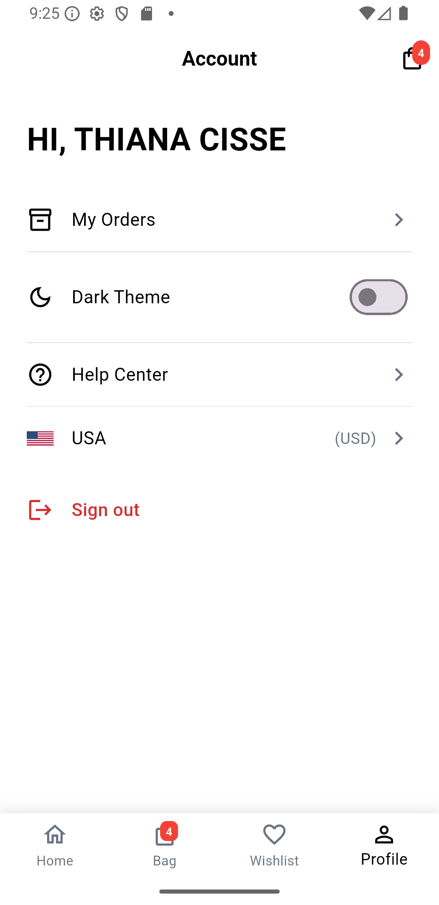
</p>

**Profile Sections:**
- **Account Information**:
  - Full name display
  - Email address
  - Phone number (if provided)
  - Edit profile functionality
- **Order Management**:
  - Order history
  - Track current orders
  - Reorder functionality
  - Download invoices
- **Settings**:
  - Theme preference (Dark/Light/System)
  - Notification preferences
  - Language selection
  - Currency selection
- **Support**:
  - Help center access
  - Contact support
  - FAQ section
  - Terms and privacy policy
- **Account Actions**:
  - Change password
  - Logout
  - Delete account

---

## 🏗 Architecture

### System Architecture

```
┌─────────────────────────────────────────────────────────┐
│                    Flutter Mobile App                    │
│  ┌──────────────────────────────────────────────────┐  │
│  │              Presentation Layer                   │  │
│  │  (Screens, Widgets, Theme Management)            │  │
│  └────────────────┬─────────────────────────────────┘  │
│                   │                                      │
│  ┌────────────────▼─────────────────────────────────┐  │
│  │              Business Logic Layer                 │  │
│  │  (Providers, State Management, Validation)       │  │
│  └────────────────┬─────────────────────────────────┘  │
│                   │                                      │
│  ┌────────────────▼─────────────────────────────────┐  │
│  │              Data Layer                           │  │
│  │  (API Client, Local Storage, Models)             │  │
│  └────────────────┬─────────────────────────────────┘  │
└───────────────────┼──────────────────────────────────┘
                    │ HTTP/REST + JWT
┌───────────────────▼──────────────────────────────────┐
│                  FastAPI Backend                      │
│  ┌──────────────────────────────────────────────────┐│
│  │              API Routes Layer                     ││
│  └────────────────┬─────────────────────────────────┘│
│  ┌────────────────▼─────────────────────────────────┐│
│  │         Business Logic Layer                      ││
│  └────────────────┬─────────────────────────────────┘│
│  ┌────────────────▼─────────────────────────────────┐│
│  │         Database Layer (SQLAlchemy)               ││
│  └────────────────┬─────────────────────────────────┘│
└───────────────────┼──────────────────────────────────┘
                    │
┌───────────────────▼──────────────────────────────────┐
│            SQLite Database                            │
└──────────────────────────────────────────────────────┘
```

### State Management Flow

The application uses the **Provider** pattern for state management:

1. **AuthProvider** - Manages authentication state and user sessions
2. **CartProvider** - Handles shopping cart operations and calculations
3. **WishlistProvider** - Manages wishlist items
4. **ThemeProvider** - Controls app-wide theme preferences

---

## 💻 Installation

### Prerequisites

- **Flutter SDK** (3.0.0 or higher)
- **Dart SDK** (3.0.0 or higher)
- **Python** (3.9 or higher)
- **pip** (Python package manager)
- **Git**

### Clone the Repository

```bash
git clone https://github.com/yourusername/maboutique.git
cd maboutique
```

### Backend Setup

1. **Navigate to backend directory:**
```bash
cd backend
```

2. **Create virtual environment:**
```bash
python -m venv venv

# Windows
venv\Scripts\activate

# macOS/Linux
source venv/bin/activate
```

3. **Install dependencies:**
```bash
pip install -r requirements.txt
```

4. **Initialize database:**
```bash
python init_db.py
```

### Frontend Setup

1. **Navigate to mobile app directory:**
```bash
cd ../mobile_app
```

2. **Install Flutter dependencies:**
```bash
flutter pub get
```

3. **Run code generation (if needed):**
```bash
flutter pub run build_runner build
```

---

## 🚀 Running the Application

### Start Backend Server

```bash
cd backend
python -m uvicorn main:app --reload --host 0.0.0.0 --port 8000
```

The API will be available at `http://localhost:8000`

**API Documentation:**
- Swagger UI: `http://localhost:8000/docs`
- ReDoc: `http://localhost:8000/redoc`

### Start Flutter App

```bash
cd mobile_app

# Run on connected device/emulator
flutter run

# Run on specific device
flutter devices  # List available devices
flutter run -d <device_id>

# Run in release mode
flutter run --release
```

### Development Tips

- **Hot Reload**: Press `r` in the terminal to hot reload changes
- **Hot Restart**: Press `R` to hot restart the app
- **Debug Mode**: Run with `flutter run --debug` for detailed logging

---

## 📚 API Documentation

### Authentication Endpoints

**Register User**
```http
POST /api/auth/register
Content-Type: application/json

{
  "full_name": "John Doe",
  "email": "john@example.com",
  "password": "SecurePass123!"
}
```

**Login**
```http
POST /api/auth/login
Content-Type: application/json

{
  "email": "john@example.com",
  "password": "SecurePass123!"
}

Response:
{
  "access_token": "eyJhbGciOiJIUzI1NiIsInR5cCI6IkpXVCJ9...",
  "token_type": "bearer",
  "user": {
    "id": 1,
    "full_name": "John Doe",
    "email": "john@example.com"
  }
}
```

### Product Endpoints

**Get All Products**
```http
GET /api/products
Authorization: Bearer {token}
```

**Get Product by ID**
```http
GET /api/products/{id}
Authorization: Bearer {token}
```

### Cart Endpoints

**Get Cart**
```http
GET /api/cart
Authorization: Bearer {token}
```

**Add to Cart**
```http
POST /api/cart/add
Authorization: Bearer {token}
Content-Type: application/json

{
  "product_id": 1,
  "quantity": 2
}
```

**Update Cart Item**
```http
PUT /api/cart/{item_id}
Authorization: Bearer {token}
Content-Type: application/json

{
  "quantity": 3
}
```

**Remove from Cart**
```http
DELETE /api/cart/{item_id}
Authorization: Bearer {token}
```

### Interactive Documentation

Visit `http://localhost:8000/docs` for Swagger UI where you can:
- Try out API endpoints directly in browser
- View request/response schemas
- Test authentication flows

---

## 📁 Project Structure

```
maboutique/
│
├── backend/
│   ├── main.py                 # FastAPI application entry
│   ├── database.py             # Database configuration
│   ├── models.py               # SQLAlchemy models
│   ├── schemas.py              # Pydantic schemas
│   ├── auth.py                 # JWT authentication
│   ├── crud.py                 # Database operations
│   ├── init_db.py              # DB initialization
│   ├── requirements.txt        # Python dependencies
│   └── maboutique.db           # SQLite database
│
├── mobile_app/
│   ├── lib/
│   │   ├── main.dart           # App entry point
│   │   ├── config/
│   │   │   ├── api_config.dart
│   │   │   └── theme_config.dart
│   │   ├── models/
│   │   │   ├── user.dart
│   │   │   ├── product.dart
│   │   │   └── cart_item.dart
│   │   ├── providers/
│   │   │   ├── auth_provider.dart
│   │   │   ├── cart_provider.dart
│   │   │   ├── wishlist_provider.dart
│   │   │   └── theme_provider.dart
│   │   ├── screens/
│   │   │   ├── splash_screen.dart
│   │   │   ├── welcome_screen.dart
│   │   │   ├── login_screen.dart
│   │   │   ├── signup_screen.dart
│   │   │   ├── home_screen.dart
│   │   │   ├── cart_screen.dart
│   │   │   ├── wishlist_screen.dart
│   │   │   └── profile_screen.dart
│   │   ├── widgets/
│   │   │   ├── product_card.dart
│   │   │   ├── cart_item_card.dart
│   │   │   └── custom_button.dart
│   │   └── services/
│   │       ├── api_service.dart
│   │       └── storage_service.dart
│   ├── android/
│   ├── ios/
│   └── pubspec.yaml
│
├── screenshots/
└── README.md
```

---

## 🔒 Security Features

### Password Security
- **Bcrypt Hashing**: Industry-standard password hashing
- **Salt Rounds**: Cost factor of 12 for optimal security
- **No Plain Text**: Passwords never stored in plain text

### Token Security
- **JWT Tokens**: Stateless authentication
- **Token Expiration**: Configurable (default: 24 hours)
- **Secure Storage**: Tokens stored securely on device
- **HTTPS Ready**: Prepared for SSL/TLS in production

### API Security
- **Protected Routes**: JWT required for sensitive endpoints
- **Input Validation**: Pydantic models validate all input
- **SQL Injection Prevention**: SQLAlchemy ORM protection
- **CORS Configuration**: Restricted to allowed origins

### Best Practices
✅ Password minimum length (8 characters)  
✅ Email format validation  
✅ Secure session management  
✅ Error messages don't leak sensitive info  
✅ SQL injection prevention through ORM  
✅ XSS protection through input sanitization  

